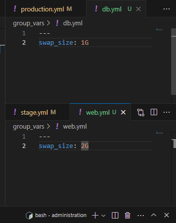

# ДЗ с1е6


## 1. прописываем в плейбук блок *(групировка задач)* со свопом
> в камон роль прописываем блок для создания свопа (камонка потому что своп он для всех)
```
- block:
    - name: create a swap file
      shell: fallocate -l {{ swap_size }} /swapfile
      args:
        creates: /swapfile

    - name: set the correct permissions
      file:
        path: /swapfile
        owner: root
        group: root
        mode: '0600'

    - name: make the file a swap file
      shell: mkswap /swapfile
      when: ansible_facts.swapfree_mb == 0

    - name: enable the swap file
      shell: swapon /swapfile
      when: ansible_facts.swapfree_mb == 0

    - name: add swap file to fstab
      mount:
        name: none
        src: /swapfile
        fstype: swap
        opts: sw
        passno: 0
        dump: 0
        state: present
```

### *краткое пояснение что тут происходит. по таскам*
> :bulb: FQCN *form := namespace.collection.content_name*

#### - create a swap file
`shell:` - модуль ансибл для выполнения команд линукс (FQCN - ansible.builtin.shell )  
`{{ swap_size }}` - переменная, которая позднее будет прописана в дефолтах роли  
`args:` - аргументы модулей shell и command  
`creates: /swapfile` - если указанный файл существует, этот будет пропущен


#### - set the correct permissions
`file` - модуль для работы с файлами (FQCN - ansible.builtin.file) здесь мы изменяли владельца, группу и парва

#### - make the file a swap file & enable the swap file
`when` - аля если *=True то запускаем таску. к этому параметру надо относится как к вопрос-ответ. пример вопрос :"когда запускать таску?" ответ: "когда свапфри == 0"


#### - add swap file to fstab
`mount` - модуль для монтирования. (FQCN - ansible.posix.mount)


## 2. запускаю плайбук без правки дефолтов
*тут я сдался и закинул в ~/.bash_aliases ap="ansible-playbook"*

`ap -i inventory/production.ini production.yml`


## 3. в дефолтах переменной прописываем переменную 
administration/roles/common/defaults/main.yaml

`swap_size = 1G`


## 4. запускаем плайбук
`ap -i inventory/production.ini production.yml`

*запуск без ошибок. скипнул мксвап и свапон как и ожидалось*  
*потому что when: **ansible_facts.swapfree_mb == 0***

> :memo: краткое пояснение по статусам таск  
> **ок:**   
    host == task  изменение не требуется  
  **changed:**  
    host != task  требовались измения. изменения пременены.  
  **skipping:**  
    условие таски не сработало. тот самый when.

## 5. повторочка


## 6. переопределение переменных для групп 
*вспоминаем про порядок. сначала **дефолты** потом **груп_варс**.*  




> *Оставь для себя только default в ролях и group_vars, будешь меньше путаться.*
