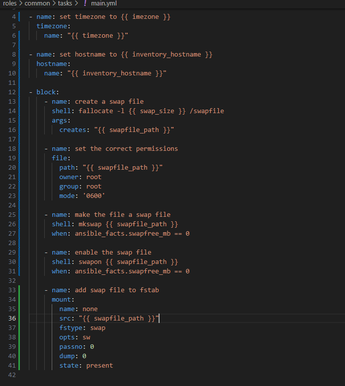

# HW


## Cсылочки  

[администрация](https://gitlab.com/prushe/administration)  
[роли](https://gitlab.com/prushe/administration-roles)


## Задания

### 1 задание 
в ./roles/common/tasks/main.yml добавил строчки
```
- name: set hostname to {{ inventory_hostname }}
  hostname:
    name: "{{ inventory_hostname }}"
```
[click](https://gitlab.com/prushe/administration-roles/-/blob/master/common/tasks/main.yml) 
 
за получения названия хоста из инвентороя отвечает переменая {{ inventory_hostname }}

stage


prod


удалил хост, отключил роль


### 2 задание
в дефолтах прописал переменые для временной зоны и место расположения файлы подкачки
  
[click](https://gitlab.com/prushe/administration-roles/-/blob/master/common/defaults/main.yml)


### 3 задание
создали роль `ansible-galaxy init swaptrasher`
прописали в роль таску
[click](https://gitlab.com/prushe/administration-roles/-/blob/master/swaptrasher/tasks/main.yml?ref_type=heads)

проверил на stage. изменения применились

